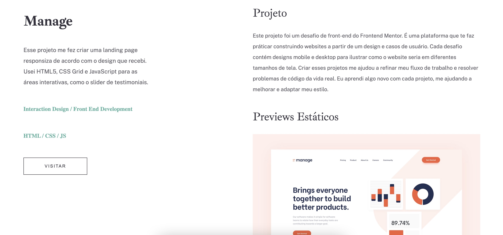

<h1 style="font-family: sans-serif;">Projeto HTML e CSS</h1>

<h2 style="font-family: sans-serif;">Sobre o projeto:</h2>

    O objetivo desse projeto foi criar uma aplicação web que funciona como um <strong>Site de Portifolio</strong>. Esse repositório armazena toda a aplicação feita apenas com HTML e CSS para colocar em pratica os conteudos aprendidos até o momento.

<h2 style="font-family: sans-serif;">Sobre o site:</h2>

    O objetivo do site é demonstrar algumas informações que seriam necesarias para a sua apresentação. Como por exemplo falar um pouco sobre voce, demonstrar seu portifolio e deixar a area de contato.

<h2 style="font-family: sans-serif;">Como Funciona:</h2>

<h3>Tela inicial</h3>

Sobre mim

 Ir para Contato

<h3 style="font-family: sans-serif;">Ao clicar em portifolio voce sera direcionado para uma pagina com o seguinte conteudo</h3>
<strong> Sera apresentado um breve resumo de cada projeto</strong>

 Manage 

 Bookmark

 Insure

 Fylo

<h3 style="font-family: sans-serif;">Ao clicar em no projeto escolhido voce sera direcionado para a pagina do projeto</h3>

Como por exemplo:

 Projeto Manage 

<h3 style="font-family: sans-serif;">Ao clicar em Contato:</h3>

<h2 style="font-family: sans-serif;">Tecnologias utilizadas</h2>

<ul>
    <li>HTML</li>
    <li>CSS</li>
</ul>

<h2 style="font-family: sans-serif;">Autor</h2>

Rodrigo Marin Prata

